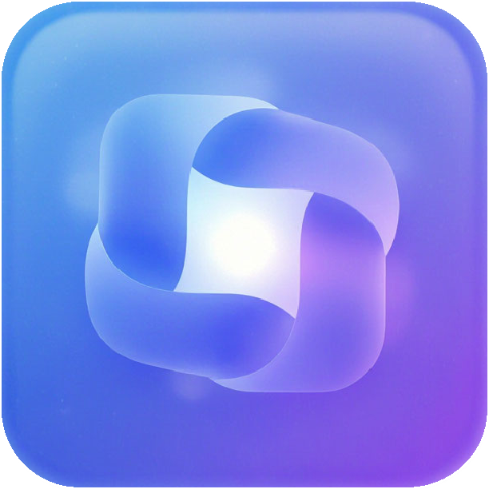
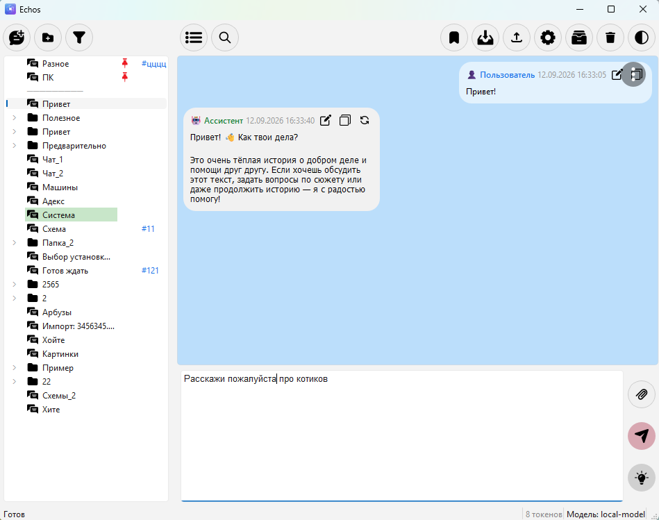
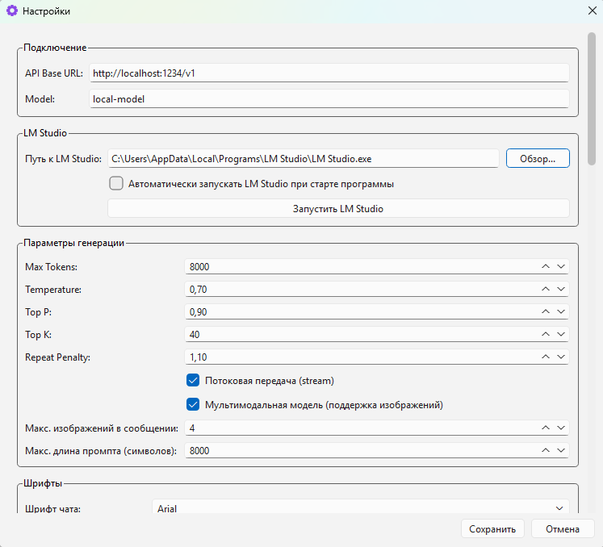
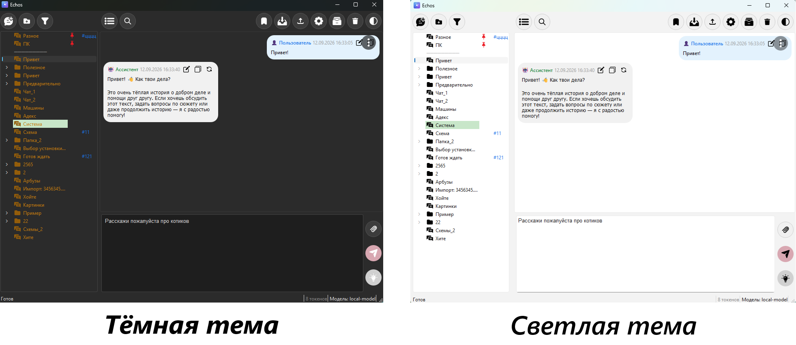
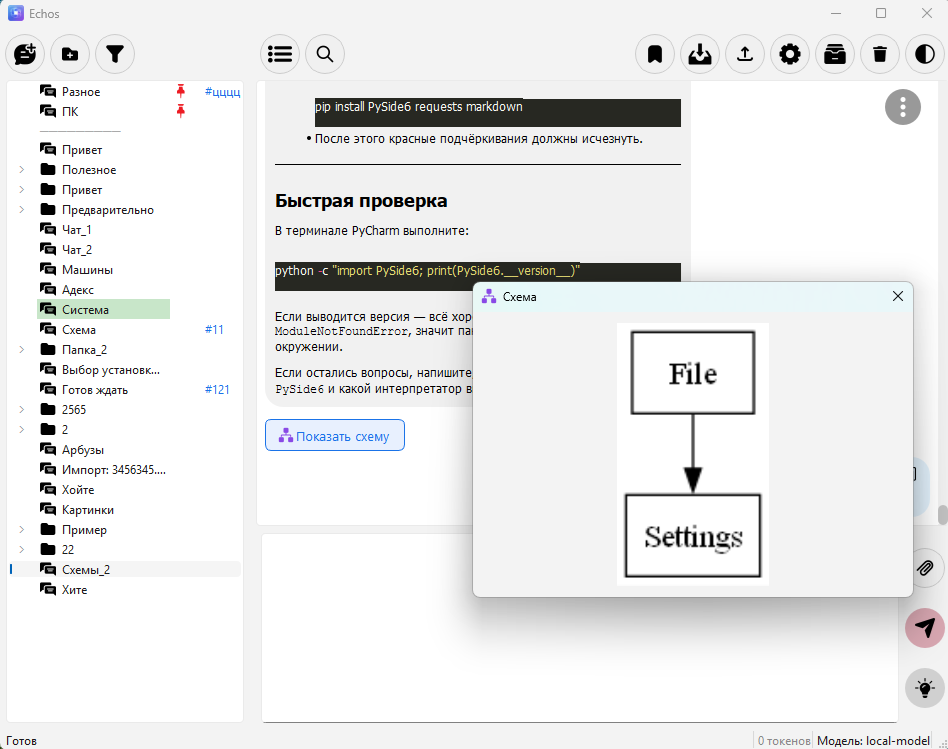
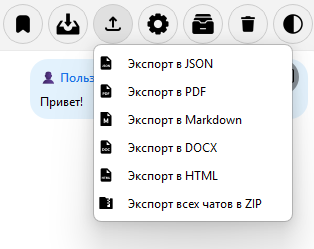

<p align="center">
  
</p>

<h1 align="center">Echos</h1>

<p align="center"><i>Echos — твой внутренний диалог, ставший видимым.</i></p>

---

## О программе

**Echos** — это настольное приложение для работы с локальными языковыми моделями через LM Studio. Программа предоставляет удобный чат-интерфейс, управление историей диалогов, поддержку вложений, шифрование данных, базу знаний (RAG), систему плагинов и множество других возможностей.

**Аудитория**: Echos подойдёт разработчикам, исследователям, техническим специалистам и всем, кто ценит приватность, контроль над данными и удобство при работе с локальными LLM.

**Преимущества:**
- 🔒 **Полная локальность и приватность** — данные не покидают ваш компьютер.
- 💾 **Безлимитная история чатов** — никаких ограничений на количество сообщений, чатов и вложений. Всё хранится локально.
- 🗂 **Гибкая организация** — папки, теги, закладки, закрепления.
- 📎 **Поддержка вложений и документов** - Отправка изображений, файлов.
- 🔍 **Гибкий поиск** — быстрый доступ к нужной информации.
- 🧩 **Расширяемость** — плагины и база знаний под любые задачи.
- 📚 **Встроенная база знаний (RAG)** - повышает качество ответов модели за счёт внешних знаний.
- ⚙ **Тонкая настройка** — под индивидуальные предпочтения.
- 🎨 **Удобный интерфейс** - светлая и тёмная темы, поддержка Markdown и подсветка синтаксиса кода.
- 📦 **Импорт/экспорт** — экспорт в JSON, PDF, Markdown, DOCX, HTML, ZIP; импорт истории из DeepSeek.
- 🆓 **Бесплатность и открытый исходный код**.
- 📈 **Отображение схем** — генерация блок-схем через Graphviz, кнопка «Показать схему» под сообщениями.

---

## ✨ Возможности

- **Многочатовость**  
  Создание и организация чатов в папки, цветовая маркировка, закрепление, архивирование, корзина.
- **Общение с LLM**  
  Потоковая генерация, остановка, редактирование сообщений, перегенерация, резюме диалога.
- **Вложения**  
  Поддержка изображений, текстовых файлов, PDF, DOCX с извлечением текста и изображений.
- **Поиск**  
  Локальный поиск в чате и глобальный по всем чатам с регулярными выражениями и фильтром по датам.
- **Безопасность**  
  Мастер-пароль, шифрование файлов (Fernet), индивидуальные пароли на чаты, режим инкогнито.
- **База знаний (RAG)**  
  Добавление документов и автоматическое использование релевантных фрагментов при запросах.
- **Плагины**  
  Расширение функциональности через Python-скрипты.
- **Гибкая настройка**  
  Параметры генерации, шрифты, уведомления, горячие клавиши.
- **Экспорт и импорт**  
  JSON, PDF, Markdown, HTML, ZIP, импорт истории DeepSeek.
- **Статистика**  
  Графики и метрики по каждому чату.
- **Счётчик непрочитанных**   
   При получении ответа в неактивный чат в заголовке окна и на иконке в панели задач появляется число. При открытии чата — сбрасывается. 
- **Тёмная и светлая темы**

---

## 📸 Скриншоты

### Главное окно


*Главное окно Echos с деревом чатов и областью диалога*

### Настройки


*Окно настроек с параметрами подключения и генерации*

### Тёмная и светлая темы


### Схемы через Graphviz


*Модель может генерировать блок-схемы прямо в чате*

### Экспорт


*Экспорт в JSON, PDF, DOCX, Markdown, HTML и ZIP*

---

## 📋 Требования

- **Python 3.8 или выше**
- **LM Studio** с запущенным локальным API (по умолчанию `http://localhost:1234/v1`)
- **Graphviz** — для отображения схем (https://graphviz.org/download/).
- Установленные зависимости (см. ниже)

---

## ⚙ Установка

1. Скопируйте файлы программы в отдельную папку или клонируйте репозиторий:

```bash
git clone https://github.com/yourusername/echos.git
cd echos
 ```

2. Установите зависимости:

```bash
pip install PySide6 requests sentence-transformers faiss-cpu numpy cryptography matplotlib markdown python-docx PyPDF2 pygments pypdfium2 pillow graphviz
```
Некоторые библиотеки являются опциональными. Если пакет отсутствует, программа продолжит работать без соответствующей функции (например, RAG, шифрование, графики).

3. Установите Graphviz (отдельная программа, не Python-библиотека).

Graphviz — это **отдельная программа** (не Python-библиотека). Она нужна для 
отображения схем и блок-схем.

2. Запустите его и **обязательно** отметьте опцию:
   - **«Add Graphviz to the system PATH for all users»**
   - (или **«for current user»**, если нет прав администратора)
3. Завершите установку.
4. **Перезапустите компьютер** (или хотя бы терминал и Echos) — чтобы PATH обновился.

> Если Graphviz не установлен, Echos продолжит работать, но кнопка
«Показать схему» не сможет отрисовать блок-схему.

4. Запустите приложение:

```bash
python main.py
 ```

---

## 🚀 Первый запуск
При первом запуске автоматически создаются:

- Папки: `chats`, `attachments`, `backups`, `plugins`, `logs`.

- Файлы настроек: `chat_config.json`, `folders.json`, `tree_order.json`, `trash.json`, `prompts.json` и другие.

Настройте подключение к LM Studio:


1. Установите LM Studio: https://lmstudio.ai
2. Запустите LM Studio
3. Загрузите модель и включите Local Server (обычно `http://localhost:1234/v1`).
3. Установите зависимости Echos: `pip install ...`
4. Запустите: `python main.py`
5. В настройках (Ctrl+P) укажите API Base URL и Model (например, ```local-model```). Создайте чат (+). Пишите.

---

## 🖥️ Интерфейс
**Левая панель**
- Кнопки создания чата, папки, сортировки.
- Дерево чатов и папок с возможностью drag-and-drop.
- Закреплённые элементы отображаются над разделителем.
- Контекстное меню (правая кнопка мыши) предоставляет действия: переименование, перемещение, цвет, закрепление, архивирование, шифрование, пароль, теги, удаление.

**Правая панель**
- Верхняя панель инструментов: глобальный поиск, закладки, импорт DeepSeek, экспорт, настройки, архив, корзина, тема.
- Область чата с плавающими кнопками (поиск, обои, статистика, промпты, очистка, повтор, резюме, параметры).
- Панель закреплённых сообщений.
- Панель вложений.
- Поле ввода с кнопками прикрепления, отправки, переключения отображения reasoning.

**Строка состояния**
- Индикатор скорости генерации (ток/с).
- Счётчик токенов в поле ввода.
- Название текущей модели.

---

## 💬 Работа с сообщениями
**Отправка**
- Введите текст и нажмите `Ctrl+Enter` или кнопку отправки.
- При необходимости прикрепите файлы (кнопка со скрепкой или перетаскивание).
- Если прикреплены не‑изображения, откроется предпросмотр перед отправкой.

**Команды**

В поле ввода доступны команды:

- `/clear` — очистить историю чата.

- `/retry` — повторить последний запрос.

- `/summary` — сделать резюме диалога.

**Действия с сообщениями**
- Кнопки на сообщениях: редактирование, копирование, перегенерация (для ассистента), открепление.
- Контекстное меню: копирование выделенного, избранное, закрепление, редактирование, удаление.

**Закреплённые сообщения**

Закреплённые сообщения отображаются в специальной панели над чатом. Клик по тексту прокручивает к сообщению.

**Избранные сообщения**

Отмечаются звездой. Доступны через кнопку «Закладки» на верхней панели.

---

## 📂 Вложения

Поддерживаемые типы:

- **Изображения**: PNG, JPG, JPEG, GIF, BMP, WEBP.

- **Текстовые файлы**: TXT, MD, PY, JSON, CSV, HTML, LOG.

- **Документы**: PDF, DOCX.

- **Прочие файлы**: копируются в `attachments` и отправляются как ссылка.

Ограничения (настраиваются):

- Максимальный размер файла (по умолчанию 20 МБ).

- Максимальное количество изображений в одном сообщении (по умолчанию 4, зависит от модели).

- Максимальная длина промпта (по умолчанию 8000 символов).

> При включённом шифровании чата вложения (изображения, файлы) также шифруются. При открытии чата вводится мастер-пароль, и вложения расшифровываются на лету. Файлы на диске остаются зашифрованными `(ENC:)` и не открываются в проводнике.

---

## 🔍 Поиск
**Внутри чата**
- Вызывается кнопкой с лупой или `Ctrl+F`.
- Поддержка регулярных выражений.
- Кнопки «Вверх» и «Вниз» для навигации по совпадениям.

**Глобальный поиск**
- Кнопка с лупой на верхней панели.
- Ищет по всем чатам.
- Фильтр по диапазону дат.
- Поддержка регулярных выражений.
- Результаты с подсветкой; двойной клик открывает чат на нужном сообщении.

---

## ⚙ Настройки
Окно настроек (Ctrl+P) содержит группы:

**Подключение**
- **API Base URL** — адрес LM Studio.
- **Model** — имя модели.

**LM Studio**
- Путь к исполняемому файлу для автозапуска.
- Автозапуск при старте программы.
- Кнопка ручного запуска.

**Параметры генерации**
- Max Tokens, Temperature, Top P, Top K, Repeat Penalty.
- Потоковая передача (stream).
- Мультимодальность (отправка изображений).
- Максимум изображений в сообщении.
- Максимальная длина промпта.

**Шрифты**
-Выбор семейства и размера для чата и редактора.

**Контекст и системный промпт**
- Максимальное количество токенов контекста.
- Глобальный системный промпт.

**Уведомления**
- Звуковые и всплывающие уведомления.
- Путь к звуковому файлу.

**Безопасность**
- Шифрование чатов.
- Мастер-пароль (установка/изменение).
- Расшифровка всех чатов.

**Дополнительно**
- Автосохранение резервных копий, интервал, количество хранимых копий.
- Автоархивация неактивных чатов.
- Включение RAG.
- Управление плагинами.
- Горячие клавиши.
- Импорт ZIP-архива.
- Информация о программе.

---

## 🔒 Безопасность и шифрование

- **Шифрование файлов**: используется библиотека `cryptography` (Fernet). При включении опции «Шифровать сохранённые чаты» устанавливается мастер-пароль. Все файлы чатов и вложения сохраняются зашифрованными `(ENC:)`. При первом входе в зашифрованный чат запрашивается мастер-пароль. Пароль можно изменить через контекстное меню «Изменить пароль» на зашифрованном чате.
- **Индивидуальные пароли на чаты**: через контекстное меню можно установить пароль на конкретный чат (хранится только хэш).
- **Режим инкогнито**: чат не сохраняется на диск. Существующий файл удаляется, история хранится только в памяти до закрытия.

> При включённом шифровании чата **вложения тоже шифруются**. Файлы на диске имеют префикс `ENC:` и не открываются в проводнике. Расшифровка происходит «на лету» при показе миниатюры, отправке в модель или экспорте.

---

## 🧩 Плагины
Плагины загружаются из папки `plugins` при старте. Создайте файл `.py` с классом `Plugin`:

```python
class Plugin:
    def on_message_send(self, text, api):
        # Модификация текста перед отправкой
        return text
    
    def on_response_received(self, text, api):
        # Модификация ответа после получения
        return text
 ```

Методы необязательны. Объект `api` предоставляет методы `log()` и `get_current_chat_title()`.

Управление плагинами — через настройки: открыть папку или вызвать менеджер.

### Пример плагина

В папке `plugins/` лежит файл `_plugin_template.py` — это шаблон 
для создания собственных плагинов.

Чтобы создать свой плагин:
1. Скопируйте `_plugin_template.py` в новый файл `my_plugin.py`
   (без подчёркивания в начале).
2. Откройте файл и измените класс `Plugin`.
3. Сохраните — плагин загрузится при следующем запуске или
   через **Настройки → Плагины → Перезагрузить**.


---

## 📚 База знаний (RAG)
- Включите RAG в настройках.
- При отправке текстового файла его содержимое автоматически добавляется в базу (если RAG включён).
- При запросах система ищет 3 релевантных фрагмента и добавляет их как системный контекст.
- При поиске используется порог релевантности — фрагменты с низкой схожестью не подмешиваются в контекст, чтобы не искажать ответ.

> Для прямого добавления документов можно использовать метод ```import_document_to_rag()``` (доступен через плагин или доработку интерфейса).

---

## 📦 Импорт и экспорт
**Импорт**

- **DeepSeek JSON** — кнопка на верхней панели. Поддержка как одиночного чата, так и нескольких (с выбором). Можно создать общую папку.

- **ZIP-архив** — через настройки. Восстанавливает чаты, вложения и служебные файлы.

**Экспорт**

Меню «Экспорт» позволяет сохранить текущий чат в:
- JSON
- PDF
- Markdown
- HTML
- DOCX
- ZIP (все чаты)

---

## 📊 Статистика
Для текущего чата доступна через плавающую кнопку «Статистика» или контекстное меню чата. Показывает:

- Дату создания и последней активности.

- Количество сообщений, символов, токенов (оценка), время генерации, количество вложений, размер файла.

- Графики (если установлен matplotlib):

  - Сообщений по дням.

  - Средняя длина ответа ассистента.

  - Расход токенов по дням.

---

## ⌨ Горячие клавиши

| Действие | Сочетание (по умолчанию)  |
|----------|---------------------------|
| Новый чат | `Ctrl+N`                  |
| Новая папка | `Ctrl+Shift+N`            |
| Закрыть чат | `Ctrl+W`                  |
| Поиск в чате | `Ctrl+F`                  |
| Импорт DeepSeek | `Ctrl+I`                  |
| Экспорт | `Ctrl+E`                  |
| Настройки | `Ctrl+P`                  |
| Отправить сообщение | `Ctrl+Enter`              |
| Переключить тему | `Ctrl+T`                  |
| Показать/скрыть боковую панель | `Ctrl+B`                  |
| Очистить историю чата | `Ctrl+Shift+L`            |
| Закладки | `Ctrl+Shift+B`            |
| Статистика | `Ctrl+Shift+S`            |
| Промпты | `Ctrl+Alt+P`              |
| Фокус на поле ввода | `Ctrl+L`                  |
| Следующий чат | `Ctrl+Tab`                |
| Предыдущий чат | `Ctrl+Shift+Tab`          |
| Параметры чата | `Ctrl+Shift+P`            |

Все сочетания можно изменить в настройках.

---

## 🛟 Резервное копирование
- **Автоматическое** — с интервалом, заданным в настройках (по умолчанию 5 минут).
- **При выходе** — программа всегда создаёт резервную копию.
- **Ручное** — экспорт всех чатов в ZIP.

Копии сохраняются в папке `backups`; количество хранимых копий настраивается.

---

## 🗂 Структура файлов
- `main.py` — точка входа.
- `chat_config.json` — настройки.
- `folders.json` — список папок.
- `tree_order.json` — порядок элементов дерева.
- `trash.json` — корзина.
- `prompts.json` — сохранённые промпты.
- `last_session.json` — последний открытый чат.
- `scroll_positions.json` — позиции прокрутки.
- `draft.txt` — черновик поля ввода.
- `chats/` — файлы чатов (JSON или зашифрованные).
- `attachments/` — вложения (изображения, файлы).
- `backups/` — резервные копии.
- `plugins/` — плагины.
- `logs/` — журналы.
- `RAG_folder/` — документы базы знаний.
- `Documentation/` — файлы справки.
- `attachments/thumbnails/` — кэш миниатюр (не используется для зашифрованных).

---

## ❗ Устранение неполадок

| Проблема | Решение |
|----------|---------|
| Ошибка соединения с API | Проверьте, что LM Studio запущен и сервер включён. Убедитесь в правильности URL и имени модели. |
| Не отображаются изображения | Установите Pillow. Проверьте пути к файлам изображений. |
| Не работает шифрование | Установите cryptography. Убедитесь, что мастер-пароль задан. |
| Не воспроизводится звук | Проверьте формат файла (MP3, WAV, OGG) и путь к нему. |
| Программа не запускается | Проверьте зависимости и логи `logs/app.log`. |
| Не отображаются схемы | Установите Graphviz и добавьте папку bin в PATH. |
| Модель отвечает пусто | Увеличьте Max Tokens в настройках или смените модель. |
| Не сохраняются чаты | Проверьте права на запись в папку `chats/`. |
| Пароль на чат не подходит | Убедитесь, что вводите пароль именно от этого чата, а не мастер-пароль. |

---

## 📜 Лицензия

Проект распространяется под лицензией **MIT**.

Кратко: вы можете свободно использовать, изменять и распространять Echos, 
включая коммерческое использование. Единственное требование — сохранить 
уведомление об авторстве (файл [LICENSE](LICENSE)).

---

## © Автор

**Vecsai** — разработчик Echos.

Copyright (c) 2026 Vecsai. Распространяется под [MIT License](LICENSE).

---

## ⚖ Товарные знаки и отказ от ответственности

**Echos** — независимый опенсорсный проект. Он **не связан** ни с одной 
из компаний, чьи продукты упоминаются ниже, не спонсируется ими и не 
одобрен ими.

### Упоминания продуктов

**DeepSeek** является товарным знаком Hangzhou DeepSeek Artificial 
Intelligence Basic Technology Research Co., Ltd. Название «DeepSeek» 
используется в Echos **исключительно для обозначения совместимости** 
с форматом экспорта чатов DeepSeek. Echos не является официальным 
клиентом DeepSeek, не связан с DeepSeek AI и не одобрен ею.

**LM Studio** является товарным знаком Element Labs, Inc. Echos 
взаимодействует с LM Studio через её локальный API для работы с 
локальными языковыми моделями. Echos не связан с Element Labs 
и не одобрен ею.

**Qt** и **PySide6** являются товарными знаками The Qt Company Ltd. 
Echos использует PySide6 в соответствии с условиями **GNU LGPL v3**. 
Echos линкуется с PySide6 **динамически**, что соответствует требованиям 
LGPL v3. Полный текст лицензии: https://www.gnu.org/licenses/lgpl-3.0.html

**Graphviz** — открытый инструмент визуализации графов, изначально 
разработанный AT&T Labs Research. Echos использует системный Graphviz 
и Python-обёртку `graphviz` (лицензия MIT) в соответствии с условиями 
их лицензий (EPL для Graphviz, MIT для Python-обёртки).

**Python** является товарным знаком Python Software Foundation.

**Windows**, **Linux** и **macOS** являются товарными знаками 
соответствующих владельцев (Microsoft Corporation, Linus Torvalds, 
Apple Inc.).

**Все остальные упомянутые названия продуктов являются товарными 
знаками их соответствующих владельцев.**

### Зависимости и их лицензии

Echos использует следующие сторонние библиотеки:

- **PySide6** — LGPL v3
- **requests** — Apache License 2.0
- **sentence-transformers** — Apache License 2.0
- **faiss-cpu** — MIT License
- **numpy** — BSD 3-Clause
- **cryptography** — Apache License 2.0 / BSD 3-Clause
- **matplotlib** — PSF-based (совместима с BSD)
- **markdown** — BSD 3-Clause
- **pygments** — BSD 2-Clause
- **python-docx** — MIT License
- **PyPDF2** — BSD 3-Clause
- **pypdfium2** — Apache License 2.0 / BSD 3-Clause
- **python-pptx** — MIT License
- **Pillow** — PIL Software License (совместима с MIT)
- **graphviz** (Python-обёртка) — MIT License

### Отказ от ответственности

Echos распространяется «**как есть**», без каких-либо гарантий, 
явных или подразумеваемых, включая гарантии товарной пригодности 
и пригодности для конкретной цели.

Автор не несёт ответственности за:
- любой ущерб, возникший в результате использования программы;
- содержимое, сгенерированное языковыми моделями;
- потерю данных, вызванную сбоями оборудования, программного 
  обеспечения или ошибками пользователя;
- нарушение авторских прав, товарных знаков или иных прав третьих 
  лиц, вызванное использованием Echos.

### Соответствие законодательству

Используя Echos, вы соглашаетесь соблюдать законодательство вашей 
юрисдикции. Автор не несёт ответственности за использование программы 
в целях, запрещённых законом.

Все остальные упомянутые названия продуктов являются товарными 
знаками их соответствующих владельцев.


