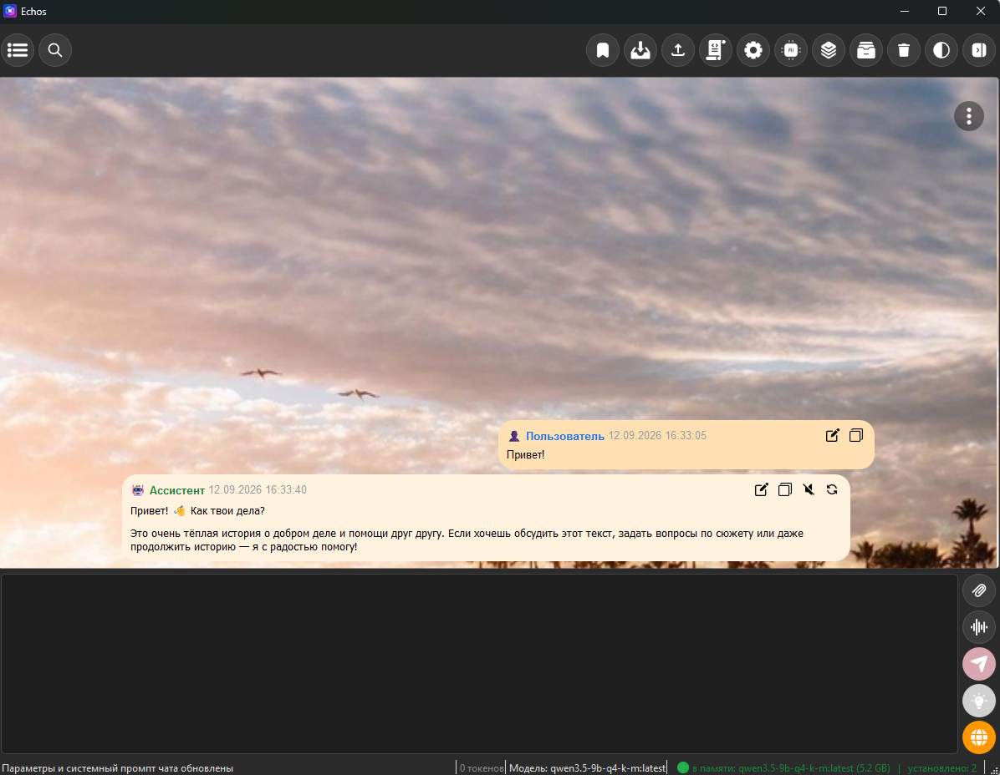
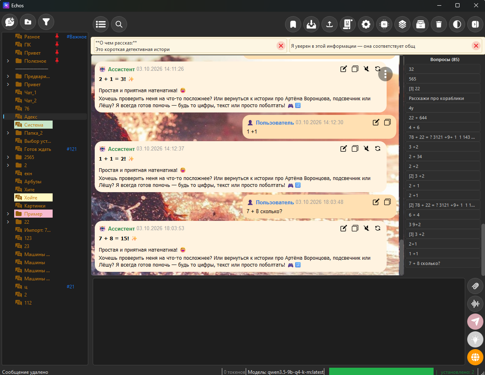
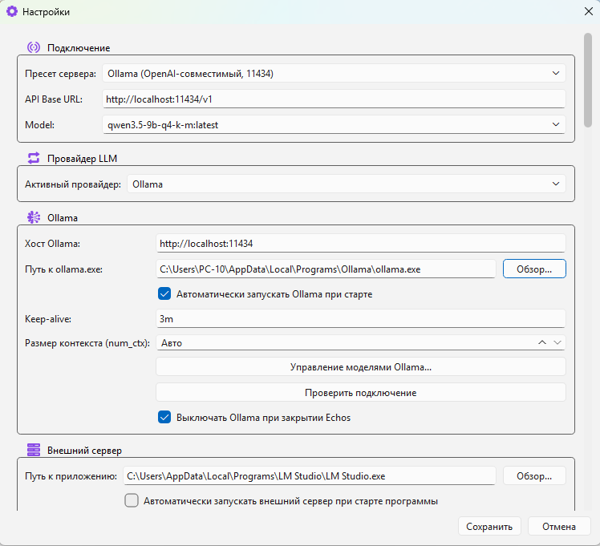
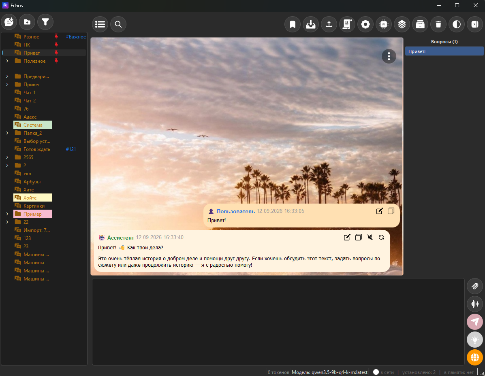
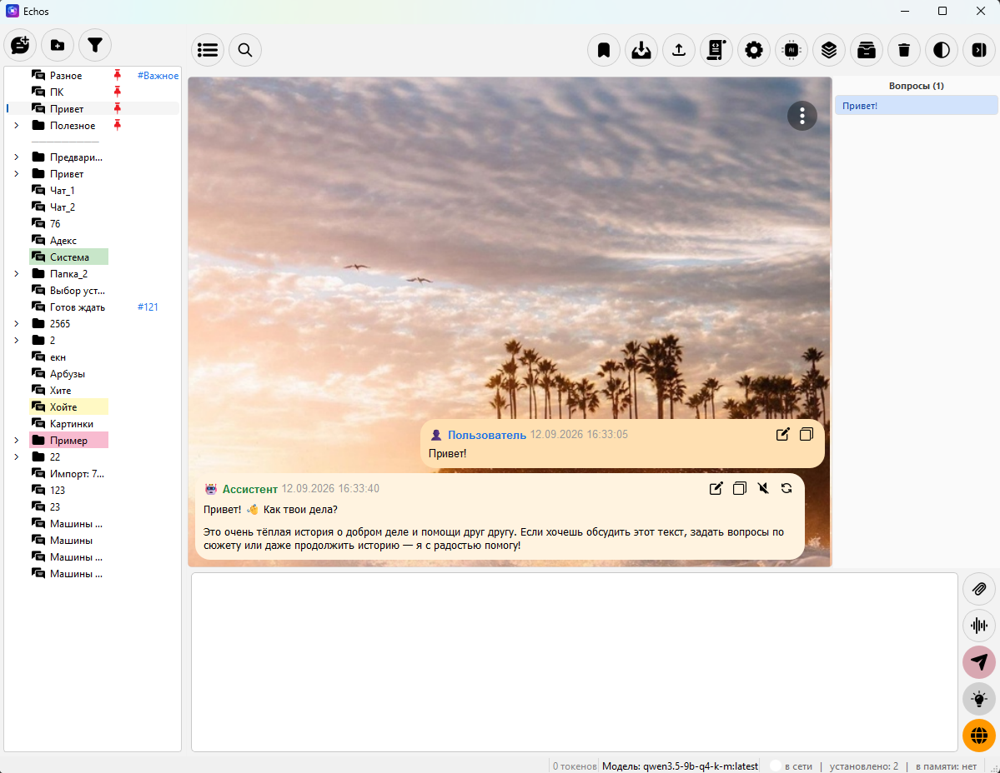
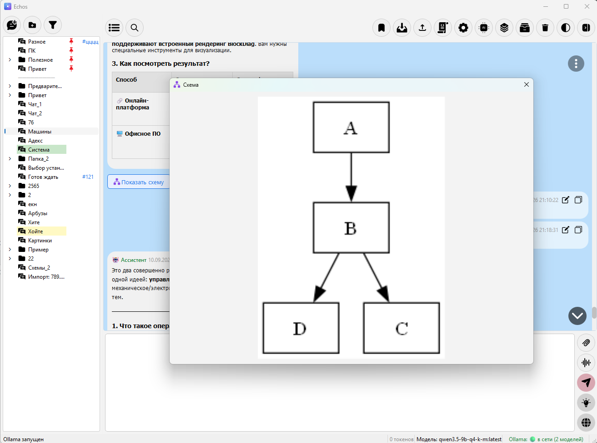
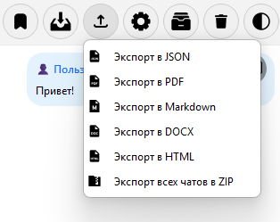
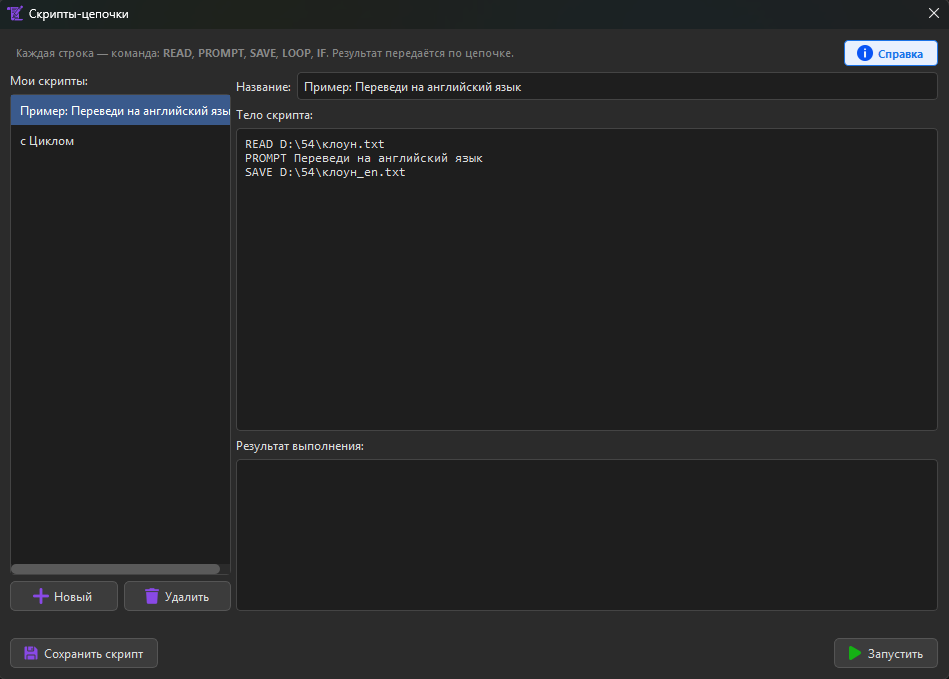
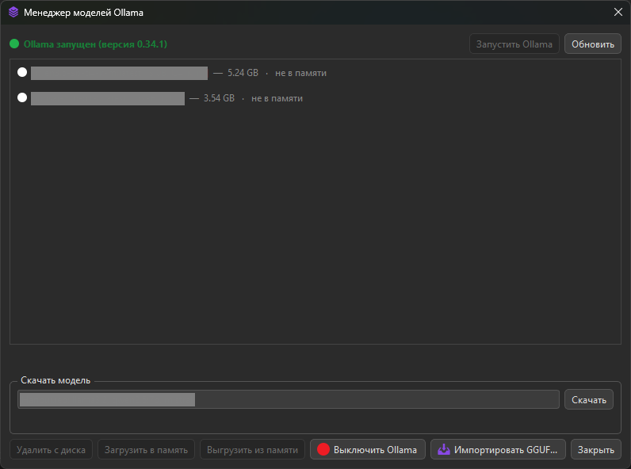

<p align="center">
  
</p>

<h1 align="center">Echos</h1>

<p align="center"><i>Echos — твой внутренний диалог, ставший видимым.</i></p>

<p align="center">
  
  
  
  
</p>

---

## 📚 Документация

- [Полное руководство](Documentation/Documentation.md)
- [Как писать плагины](Documentation/Plugins.md)

---

## 📑 Оглавление

- [О программе](#о-программе)
- [Возможности](#-возможности)
- [Скриншоты](#-скриншоты)
- [Требования](#-требования)
- [Быстрый старт](#-быстрый-старт)
- [Установка](#-установка)
- [Провайдеры LLM](#-провайдеры-llm)
  - [Ollama](#-ollama)
  - [LM Studio](#-lm-studio)
- [Интерфейс](#-интерфейс)
- [Работа с сообщениями](#-работа-с-сообщениями)
- [Вложения](#-вложения)
- [Поиск](#-поиск)
- [Инструменты MCP](#-инструменты-mcp)
- [База знаний (RAG)](#-база-знаний-rag)
- [TTS и STT](#-озвучивание-и-распознавание-речи)
- [Скрипты-цепочки](#-скрипты-цепочки)
- [Шифрование](#-безопасность-и-шифрование)
- [Плагины](#-плагины)
- [Импорт и экспорт](#-импорт-и-экспорт)
- [Статистика](#-статистика)
- [Горячие клавиши](#-горячие-клавиши)
- [Резервное копирование](#-резервное-копирование)
- [Структура файлов](#-структура-файлов)
- [Устранение неполадок](#-устранение-неполадок)
- [Roadmap](#-roadmap)
- [Лицензия](#-лицензия)

---

## О программе

**Echos** — это настольное приложение для работы с локальными языковыми моделями через **LM Studio** и **Ollama**. Программа предоставляет удобный чат-интерфейс, управление историей диалогов, поддержку вложений, шифрование данных, базу знаний (RAG), инструменты MCP, систему плагинов, скрипты-цепочки, озвучивание ответов и распознавание речи.

**Аудитория**: Echos подойдёт разработчикам, исследователям, техническим специалистам и всем, кто ценит приватность, контроль над данными и удобство при работе с локальными LLM.

**Преимущества:**

- 🔒 **Полная локальность и приватность** — данные не покидают ваш компьютер.
- 💾 **Безлимитная история чатов** — никаких ограничений на количество сообщений, чатов и вложений. Всё хранится локально.
- 🗂 **Гибкая организация** — папки, теги, закладки, закрепления.
- 📎 **Поддержка вложений и документов** — изображения, текстовые файлы, PDF, DOCX, PPTX.
- 🔍 **Гибкий поиск** — быстрый доступ к нужной информации (локальный + глобальный).
- 🧩 **Расширяемость** — плагины и база знаний под любые задачи.
- 📚 **Встроенная база знаний (RAG)** — гибридный поиск и ре-ранкер повышают качество ответов.
- 🔧 **Инструменты MCP** — модель может читать/изменять файлы и искать в интернете.
- 🔊 **Озвучивание (TTS)** — модели могут «говорить».
- 🎤 **Транскрибация (STT)** — распознавание речи из аудио и видео.
- 📜 **Скрипты-цепочки** — автоматизация массовой обработки файлов.
- ⚙ **Тонкая настройка** — под индивидуальные предпочтения.
- 🎨 **Удобный интерфейс** — светлая и тёмная темы, поддержка Markdown и подсветка синтаксиса кода.
- 📦 **Импорт/экспорт** — JSON, PDF, DOCX, Markdown, HTML, ZIP; импорт истории из DeepSeek.
- 🆓 **Бесплатность и открытый исходный код**.
- 📈 **Отображение схем** — блок-схемы через Graphviz.
---

## ✨ Возможности

- **Многочатовость**  
  Создание и организация чатов в папки, цветовая маркировка, закрепление, архивирование, корзина.

- **Общение с LLM**  
  Потоковая генерация, остановка, редактирование сообщений, перегенерация, резюме диалога.

- **Два провайдера LLM**  
  Ollama (нативно) и LM Studio (OpenAI-совместимый API). Автозапуск, менеджер моделей, импорт GGUF.

- **Вложения**  
  Изображения, текстовые файлы, PDF, DOCX, PPTX — с извлечением текста, изображений и таблиц.

- **Поиск**  
  Локальный поиск в чате и глобальный по всем чатам с регулярными выражениями и фильтром по датам.

- **Безопасность**  
  Мастер-пароль, шифрование файлов (Fernet), индивидуальные пароли на чаты, режим инкогнито.

- **База знаний (RAG)**  
  Индексируемые папки, авто-обновление, гибридный поиск (FAISS + BM25 + RRF), ре-ранкер, кликабельные источники.

- **Инструменты MCP**  
  Работа с файловой системой (чтение/поиск/запись/удаление) и интернет-поиск с белым списком доменов.

- **Озвучивание (TTS)**  
  Системные голоса, кнопки 🔊/🔇 на сообщениях.

- **Транскрибация (STT)**  
  Распознавание речи из аудио/видео через `faster-whisper`, полностью оффлайн.

- **Скрипты-цепочки**  
  `READ` / `PROMPT` / `SAVE`, циклы `LOOP ... END`, ветвления `IF ... ELSE ... END`.

- **Мини-карта вопросов**  
  Список вопросов пользователя справа от чата. Клик → плавный переход.

- **Плагины**  
  Расширение функциональности через Python-скрипты.

- **Гибкая настройка**  
  Параметры генерации, шрифты, уведомления, горячие клавиши.

- **Экспорт и импорт**  
  JSON, PDF, Markdown, HTML, DOCX, ZIP; импорт истории DeepSeek.

- **Статистика**  
  Графики и метрики по каждому чату.

- **Счётчик непрочитанных**  
  Число на иконке в панели задач и в заголовке окна.

- **Тёмная и светлая темы**

---

## 📸 Скриншоты

### Главное окно


*Главное окно Echos с деревом чатов и областью диалога*



### Настройки


*Окно настроек с параметрами подключения и генерации*

### Тёмная тема



### Светлая тема



### Схемы через Graphviz


*Модель может генерировать блок-схемы прямо в чате*

### Экспорт


*Экспорт в JSON, PDF, DOCX, Markdown, HTML и ZIP*

### Скрипты-цепочки



* Окно написания скриптов для модели

### Скрипты-цепочки



* Окно управления моделями

---

## 📋 Требования

- **Python 3.10 или выше**
- **Один из провайдеров LLM**:
  - **Ollama** (рекомендуется) — https://ollama.com/download. Без **Ollama** `ollama pull` **не сработает** — в быстром старте пользователь должен уже иметь Ollama.
  - **LM Studio** — https://lmstudio.ai
- **ffmpeg** — для транскрибации аудио/видео (STT)
  - Windows: `winget install ffmpeg`
- **Graphviz** — для отображения блок-схем: https://graphviz.org/download/
- Установленные Python-зависимости (см. ниже)
- **~5 ГБ свободного места** — под модели и зависимости (torch, faiss, whisper и т.д.)

---

## 🚀 Быстрый старт (за 5 минут)

1. Установите **Ollama**: https://ollama.com/download

2. Скачайте модель:
   ```bash
   ollama pull qwen2.5:7b
   ```

3. Установите зависимости Echos:
   ```bash
   pip install PySide6 requests
   ```

4. Запустите Echos:
   ```bash
   python main.py
   ```

5. Создайте чат (➕) и напишите сообщение.

---

## ⚙ Установка

### 1. Клонирование репозитория

```bash
git clone https://github.com/Vecsai/Echos.git
cd Echos
```

### 2. Установка зависимостей

**Обязательные:**

```bash
pip install PySide6 requests
```

**RAG (база знаний):**

```bash
pip install sentence-transformers faiss-cpu numpy rank_bm25
```

**Озвучивание (TTS):**

```bash
pip install pyttsx3
```

На Windows также требуется `pywin32`:

```bash
pip install pywin32
python -m pywin32_postinstall -install
```

**Транскрибация (STT):**

```bash
pip install faster-whisper
```

Требуется `ffmpeg` — см. раздел «Требования».

**Документы и экспорт:**

```bash
pip install python-docx python-pptx PyPDF2 pypdfium2 pdfplumber markdown pygments
```

**Прочее:**

```bash
pip install cryptography matplotlib pillow graphviz
```

> Некоторые библиотеки опциональны. Если пакет отсутствует, программа продолжит работать без соответствующей функции.

### 3. Установка Graphviz

Graphviz — это **отдельная программа**, не Python-библиотека.

1. Скачайте установщик: https://graphviz.org/download/
2. Запустите установщик и **обязательно** отметьте:
   - **«Add Graphviz to the system PATH for all users»**
3. Завершите установку и **перезапустите компьютер**.

> Без Graphviz кнопка «Показать схему» не сможет отрисовать блок-схему.

### 4. Запуск

```bash
python main.py
```

---

## 🔀 Провайдеры LLM

Echos поддерживает два типа провайдеров локальных языковых моделей.

### 🦙 Ollama

**Нативная поддержка** через API Ollama.

- Управление моделями через менеджер (кнопка 📥 в верхней панели):
  - Скачивание моделей: `llama3.2`, `qwen2.5:7b`, `mistral` и др.
  - Удаление с диска
  - Выгрузка из памяти (освобождение VRAM/RAM)
  - Проверка подключения
- **Импорт GGUF-файлов** через Modelfile — с автоматическим выбором шаблона чата (ChatML, Llama 3, Mistral, Gemma, Phi).
- Автозапуск Ollama при старте Echos.
- Автовыключение Ollama при закрытии Echos.
- Настройка `keep_alive` и `num_ctx`.
- Индикатор статуса в строке состояния: `🟢 в сети`, `🟢 загружена модель X`, `🔴 не запущен`.

### 🗄️ LM Studio и внешние OpenAI-совместимые серверы

Через стандартный OpenAI API (`/v1/chat/completions`).

- Поддержка любых OpenAI-совместимых серверов:
  - **LM Studio** (`http://localhost:1234/v1`)
  - **vLLM** (`http://localhost:8000/v1`)
  - **text-generation-webui** (`http://localhost:5000/v1`)
  - **KoboldCpp** (`http://localhost:5001/v1`)
  - **LocalAI** (`http://localhost:8080/v1`)
  - **OpenRouter** и другие облачные сервисы
- Быстрые пресеты в настройках.
- Автозапуск приложения LM Studio.

---

## 🔧 Инструменты MCP

Позволяют модели **самой** выполнять действия на вашем компьютере. По умолчанию **выключены** — включаются в диалоге 🔧 Инструменты MCP.

### Файловые инструменты

- `read_file` — прочитать файл
- `list_directory` — список файлов в папке
- `tree` — дерево каталогов (структура проекта)
- `search_files` — поиск файлов по имени (glob)
- `search_within_files` — поиск текста внутри файлов
- `write_file` ⚠ — создание/перезапись файла
- `modify_file` ⚠ — замена текста в файле
- `move_file` ⚠ — перемещение/переименование
- `delete_file` ⚠ — удаление

### Безопасность

- **Белый список папок** — модель работает **только** внутри разрешённых директорий.
- **Подтверждение опасных действий** — по умолчанию Echos спрашивает разрешение перед записью / удалением (рекомендуется).
- **Лог вызовов** — все действия модели записываются в `logs/mcp.log`.
- **Лимиты** — максимальный размер файла для чтения, максимальное количество результатов поиска.

### 🌐 Интернет-поиск

Дополнительная возможность — модель может искать в интернете через DuckDuckGo.

- **Белый список доменов** в файле `Sites.txt` — модель работает только с разрешёнными сайтами.
- Поддержка wildcard: `*.github.com` — все поддомены.
- **Кэширование** страниц (TTL настраивается).
- **Защита от промпт-инъекций** — подозрительные фразы в тексте страницы заменяются на `[УДАЛЕНО]`.
- Инструменты:
  - `web_search` — поиск через DuckDuckGo
  - `fetch_url` — загрузка содержимого страницы

---

## 🖥️ Интерфейс
**Левая панель**
- Кнопки создания чата, папки, сортировки.
- Дерево чатов и папок с возможностью drag-and-drop.
- Закреплённые элементы отображаются над разделителем.
- Контекстное меню (правая кнопка мыши) предоставляет действия: переименование, перемещение, цвет, закрепление, архивирование, шифрование, пароль, теги, удаление.

**Правая панель**
- Верхняя панель инструментов: глобальный поиск, закладки, импорт DeepSeek, экспорт, настройки, архив, корзина, тема.
- Область чата с плавающими кнопками (поиск, обои, статистика, промпты, очистка, повтор, резюме, параметры).
- Панель закреплённых сообщений.
- Панель вложений.
- Поле ввода с кнопками прикрепления, отправки, переключения отображения reasoning.

**Строка состояния**
- Индикатор скорости генерации (ток/с).
- Счётчик токенов в поле ввода.
- Название текущей модели.

**Мини-карта вопросов**
- Панель справа со списком вопросов пользователя в текущем чате.
- Клик → плавный переход к сообщению.
- Показ/скрытие кнопкой в верхней панели.
- Повторяющиеся вопросы нумеруются: `[2] ууу`, `[3] ууу`.

---

## 💬 Работа с сообщениями
**Отправка**
- Введите текст и нажмите `Ctrl+Enter` или кнопку отправки.
- При необходимости прикрепите файлы (кнопка со скрепкой или перетаскивание).
- Если прикреплены не‑изображения, откроется предпросмотр перед отправкой.

**Команды**

В поле ввода доступны команды:

- `/clear` — очистить историю чата.

- `/retry` — повторить последний запрос.

- `/summary` — сделать резюме диалога.

**Действия с сообщениями**
- Кнопки на сообщениях: редактирование, копирование, перегенерация (для ассистента), открепление.
- Контекстное меню: копирование выделенного, избранное, закрепление, редактирование, удаление.

**Закреплённые сообщения**

Закреплённые сообщения отображаются в специальной панели над чатом. Клик по тексту прокручивает к сообщению.

**Избранные сообщения**

Отмечаются звездой. Доступны через кнопку «Закладки» на верхней панели.

---

## 📂 Вложения

Поддерживаемые типы:

- **Изображения**: PNG, JPG, JPEG, GIF, BMP, WEBP.

- **Текстовые файлы**: TXT, MD, PY, JSON, CSV, HTML, LOG.

- **Документы**: PDF, DOCX, PPTX.

- **Прочие файлы**: копируются в `attachments` и отправляются как ссылка.

Ограничения (настраиваются):

- Максимальный размер файла (по умолчанию 20 МБ).

- Максимальное количество изображений в одном сообщении (по умолчанию 4, зависит от модели).

- Максимальная длина промпта (по умолчанию 8000 символов).

> При включённом шифровании чата вложения (изображения, файлы) также шифруются. При открытии чата вводится мастер-пароль, и вложения расшифровываются на лету. Файлы на диске остаются зашифрованными `(ENC:)` и не открываются в проводнике.

---

## 🔍 Поиск
**Внутри чата**
- Вызывается кнопкой с лупой или `Ctrl+F`.
- Поддержка регулярных выражений.
- Кнопки «Вверх» и «Вниз» для навигации по совпадениям.

**Глобальный поиск**
- Кнопка с лупой на верхней панели.
- Ищет по всем чатам.
- Фильтр по диапазону дат.
- Поддержка регулярных выражений.
- Результаты с подсветкой; двойной клик открывает чат на нужном сообщении.

---

## ⚙ Настройки
Окно настроек (Ctrl+P) содержит группы:

**Подключение**
- **API Base URL** — адрес LM Studio.
- **Model** — имя модели.

**LM Studio**
- Путь к исполняемому файлу для автозапуска.
- Автозапуск при старте программы.
- Кнопка ручного запуска.

**Параметры генерации**
- Max Tokens, Temperature, Top P, Top K, Repeat Penalty.
- Потоковая передача (stream).
- Мультимодальность (отправка изображений).
- Максимум изображений в сообщении.
- Максимальная длина промпта.

**Шрифты**
- Выбор семейства и размера для чата и редактора.

**Контекст и системный промпт**
- Максимальное количество токенов контекста.
- Глобальный системный промпт.

**Уведомления**
- Звуковые и всплывающие уведомления.
- Путь к звуковому файлу.

**Безопасность**
- Шифрование чатов.
- Мастер-пароль (установка/изменение).
- Расшифровка всех чатов.

**Дополнительно**
- Автосохранение резервных копий, интервал, количество хранимых копий.
- Автоархивация неактивных чатов.
- Включение RAG.
- Управление плагинами.
- Горячие клавиши.
- Импорт ZIP-архива.
- Информация о программе.

---

## 🔒 Безопасность и шифрование

- **Шифрование файлов**: используется библиотека `cryptography` (Fernet). При включении опции «Шифровать сохранённые чаты» устанавливается мастер-пароль. Все файлы чатов и вложения сохраняются зашифрованными `(ENC:)`. При первом входе в зашифрованный чат запрашивается мастер-пароль. Пароль можно изменить через контекстное меню «Изменить пароль» на зашифрованном чате.
- **Индивидуальные пароли на чаты**: через контекстное меню можно установить пароль на конкретный чат (хранится только хэш).
- **Режим инкогнито**: чат не сохраняется на диск. Существующий файл удаляется, история хранится только в памяти до закрытия.

> При включённом шифровании чата **вложения тоже шифруются**. Файлы на диске имеют префикс `ENC:` и не открываются в проводнике. Расшифровка происходит «на лету» при показе миниатюры, отправке в модель или экспорте.

---

## 🧩 Плагины
Плагины загружаются из папки `plugins` при старте. Создайте файл `.py` с классом `Plugin`:

```python
class Plugin:
    def on_message_send(self, text, api):
        return text
    
    def on_response_received(self, text, api):
        return text
 ```

Методы необязательны. Объект `api` предоставляет методы `log()` и `get_current_chat_title()`.

Управление плагинами — через настройки: открыть папку или вызвать менеджер.

### Пример плагина

В папке `plugins/` лежит файл `_plugin_template.py` — это шаблон 
для создания собственных плагинов.

Чтобы создать свой плагин:
1. Скопируйте `_plugin_template.py` в новый файл `my_plugin.py`
   (без подчёркивания в начале).
2. Откройте файл и измените класс `Plugin`.
3. Сохраните — плагин загрузится при следующем запуске или
   через **Настройки → Плагины → Перезагрузить**.


---

## 📚 База знаний (RAG)

RAG позволяет модели отвечать, **опираясь на ваши документы**, а не только на свои обучающие данные.

### Индексируемые папки

- Указывайте **любые папки** на диске — Echos их проиндексирует.
- Автоматическое **отслеживание изменений** — переиндексация раз в N минут (настраивается).
- Поддерживаемые форматы: `txt`, `md`, `py`, `json`, `csv`, `html`, `log`, `pdf`, `docx`, `pptx`.
- **Извлечение таблиц** из PDF, DOCX, PPTX — таблицы сохраняются как Markdown.

### Как работает поиск

1. Вы задаёте вопрос.
2. Echos ищет релевантные фрагменты **гибридным поиском**:
   - **FAISS** — по смыслу (эмбеддинги `paraphrase-multilingual-MiniLM-L12-v2`)
   - **BM25** — по точным словам
   - **RRF** — объединение результатов обоих поисков
3. **Ре-ранкер** `bge-reranker-base` пересортировывает топ кандидатов, оставляя только **реально релевантные**.
4. Найденные фрагменты **подмешиваются в контекст** запроса.

### Источники под ответом

- Кнопка **📚 Источники (N)** под ответом ассистента.
- Клик → диалог со списком: имя файла, фрагмент, релевантность.
- **Кликабельные ссылки `[1]`, `[2]`** прямо в тексте ответа — клик открывает источник.
- Кнопки: **📂 Открыть источник**, **📋 Скопировать путь**.
- Поддержка **веб-источников** — если модель использовала интернет-поиск, они тоже в списке.

### Настройка

- **Настройки → 📚 База знаний (RAG)**:
  - Включить RAG
  - 📂 Индексируемые папки — добавление/удаление/переиндексация
  - Интервал проверки изменений
  - Просмотр базы знаний
  - Очистка кэша

---

## 🔊 Озвучивание и распознавание речи

### TTS — озвучивание ответов

- Библиотека: `pyttsx3` (или `py3-tts` для Python 3.13+).
- Кнопка **🔊/🔇** в шапке каждого сообщения ассистента — нажатие включает/выключает озвучку.
- В настройках: выбор голоса (все системные), скорость, громкость, тест голоса.
- **Markdown-разметка** вырезается перед озвучкой — модель читает чистый текст, без символов.

### STT — транскрибация файлов

- Библиотека: `faster-whisper` (полностью оффлайн после первой загрузки модели).
- Кнопка **🎤** рядом с 📎 — выбрать файл → распознать.
- Поддерживаемые форматы: `mp3`, `wav`, `m4a`, `ogg`, `flac`, `aac`, `mp4`, `mkv`, `mov`, `avi`, `webm`.
- Модели на выбор: `tiny`, `base`, `small` (рекомендуется), `medium`, `large-v3`.
- **Модель выгружается из памяти после работы** — RAM не забивается.
- Работает **без интернета** после первой загрузки модели.

### Требования

- **TTS**: `pip install pyttsx3`
- **STT**: `pip install faster-whisper` + `ffmpeg`

---

## 📜 Скрипты-цепочки

Инструмент для **автоматической обработки файлов** одной командой. Скрипт — это список шагов, которые Echos выполняет по очереди, передавая результат следующему.

### Как открыть

- Кнопка **📜** в верхней панели.
- Кнопка **❓ Справка** внутри диалога — полная документация с примерами.

### Команды

| Команда | Что делает |
|---------|-----------|
| `READ путь` | Прочитать файл (txt, pdf, docx, py, md и др.) |
| `PROMPT инструкция` | Отправить запрос модели |
| `SAVE путь` | Сохранить результат в файл |
| `LOOP маска ... END` | Повторить блок для каждого файла в папке |
| `IF условие ... ELSE ... END` | Ветвление по содержимому результата |

### Переменные

- `{{file}}` — полный путь к файлу в цикле
- `{{file.name}}` — имя файла (error_1.log)
- `{{file.stem}}` — имя без расширения (error_1)
- `{{file.ext}}` — расширение (.log)
- `{{index}}` — номер файла в цикле (1, 2, 3...)
- `{{date}}`, `{{time}}`, `{{timestamp}}` — текущая дата/время

### Примеры

**Простая выжимка:**

```
READ D:\docs\report.pdf
PROMPT Сделай краткое резюме в 5 пунктах
SAVE D:\docs\summary_{{date}}.md
```

**Массовый перевод всех txt в папке:**

```
LOOP D:\texts\*.txt
READ {{file}}
PROMPT Переведи на английский, сохрани стиль
SAVE D:\texts_en\{{file.name}}
END
```

**Сортировка логов по критичности:**

```
LOOP D:\logs\*.log
READ {{file}}
PROMPT Определи уровень проблем (CRITICAL/WARNING/OK)
IF содержит "CRITICAL"
SAVE D:\reports\critical\{{file.stem}}.md
ELSE
SAVE D:\reports\ok\{{file.stem}}.md
END
END
```

### Условия

Поддерживаются в `IF`:
- `содержит "текст"`
- `не содержит "текст"`
- `начинается с "текст"`
- `заканчивается на "текст"`
- `длина больше N`
- `длина меньше N`

---

## 📦 Импорт и экспорт
**Импорт**

- **DeepSeek JSON** — кнопка на верхней панели. Поддержка как одиночного чата, так и нескольких (с выбором). Можно создать общую папку.

- **ZIP-архив** — через настройки. Восстанавливает чаты, вложения и служебные файлы.

**Экспорт**

Меню «Экспорт» позволяет сохранить текущий чат в:
- JSON
- PDF
- Markdown
- HTML
- DOCX
- ZIP (все чаты)

---

## 📊 Статистика
Для текущего чата доступна через плавающую кнопку «Статистика» или контекстное меню чата. Показывает:

- Дату создания и последней активности.

- Количество сообщений, символов, токенов (оценка), время генерации, количество вложений, размер файла.

- Графики (если установлен matplotlib):

  - Сообщений по дням.

  - Средняя длина ответа ассистента.

  - Расход токенов по дням.

---

## ⌨ Горячие клавиши

| Действие | Сочетание (по умолчанию)  |
|----------|---------------------------|
| Новый чат | `Ctrl+N`                  |
| Новая папка | `Ctrl+Shift+N`            |
| Закрыть чат | `Ctrl+W`                  |
| Поиск в чате | `Ctrl+F`                  |
| Импорт DeepSeek | `Ctrl+I`                  |
| Экспорт | `Ctrl+E`                  |
| Настройки | `Ctrl+P`                  |
| Отправить сообщение | `Ctrl+Enter`              |
| Переключить тему | `Ctrl+T`                  |
| Показать/скрыть боковую панель | `Ctrl+B`                  |
| Очистить историю чата | `Ctrl+Shift+L`            |
| Закладки | `Ctrl+Shift+B`            |
| Статистика | `Ctrl+Shift+S`            |
| Промпты | `Ctrl+Alt+P`              |
| Фокус на поле ввода | `Ctrl+L`                  |
| Следующий чат | `Ctrl+Tab`                |
| Предыдущий чат | `Ctrl+Shift+Tab`          |
| Параметры чата | `Ctrl+Shift+P`            |

Все сочетания можно изменить в настройках.

---

## 🛟 Резервное копирование
- **Автоматическое** — с интервалом, заданным в настройках (по умолчанию 5 минут).
- **При выходе** — программа всегда создаёт резервную копию.
- **Ручное** — экспорт всех чатов в ZIP.

Копии сохраняются в папке `backups`; количество хранимых копий настраивается.

---

## 🗂 Структура файлов
- `main.py` — точка входа.
- `chat_config.json` — настройки.
- `folders.json` — список папок.
- `tree_order.json` — порядок элементов дерева.
- `trash.json` — корзина.
- `prompts.json` — сохранённые промпты.
- `last_session.json` — последний открытый чат.
- `scroll_positions.json` — позиции прокрутки.
- `draft.txt` — черновик поля ввода.
- `chats/` — файлы чатов (JSON или зашифрованные).
- `attachments/` — вложения (изображения, файлы).
- `backups/` — резервные копии.
- `plugins/` — плагины.
- `logs/` — журналы.
- `RAG_folder/` — документы базы знаний.
- `attachments/thumbnails/` — кэш миниатюр (не используется для зашифрованных).
- `RAG_index/` — индекс базы знаний
- `scripts.json` — сохранённые скрипты-цепочки
- `corrupted/` — повреждённые файлы (автоматически при загрузке)
- `Image/`, `Image_White/`, `Image_Context_menu/`, `Image_Context_menu_White/`, `Image_settings/` — иконки интерфейса
- `Icon/` — иконка приложения
- `Sound/` — звуковые файлы уведомлений
- `Documentation/` — встроенная справка (F1)
- `Sites.txt` — белый список сайтов для MCP-интернет-поиска

- 
---

## ❗ Устранение неполадок

| Проблема | Решение |
|----------|---------|
| Ошибка соединения с API | Проверьте, что Ollama или LM Studio запущены. Убедитесь в правильности URL и имени модели. |
| `std::bad_alloc` | Не хватает памяти — уменьшите `num_ctx` в настройках Ollama (например, до 8192). |
| `System message must be at the beginning` | Очистите системный промпт в параметрах чата или смените модель. |
| Не отображаются изображения | Установите Pillow. Проверьте пути к файлам. |
| Не работает шифрование | Установите `cryptography`. Убедитесь, что мастер-пароль задан. |
| Не воспроизводится звук (TTS) | Проверьте формат файла (MP3, WAV, OGG) и путь. Установите `pyttsx3` + `pywin32`. |
| Не работает STT | Установите `faster-whisper` и `ffmpeg`. Проверьте `ffmpeg -version` в терминале. |
| Программа не запускается | Проверьте зависимости и логи `logs/app.log`. |
| Не отображаются схемы | Установите Graphviz и добавьте папку `bin` в PATH. |
| RAG не находит нужное | Проверьте, что папка проиндексирована. Уменьшите порог релевантности. |
| Не сохраняются чаты | Проверьте права на запись в папку `chats/`. |
| Пароль на чат не подходит | Убедитесь, что вводите пароль именно от этого чата. |
| Белый экран при старте | Проверьте `logs/app.log`. Возможно, повреждён файл чата. |

---

## 🗺 Roadmap

- [ ] Кроссплатформенность (Linux / macOS)
- [ ] Сборка `.exe` для Windows (установщик)
- [ ] Второй ре-ранкер (более точный, `bge-reranker-large`)
- [ ] Экспорт в Notion / Obsidian
- [ ] Пакетная обработка через скрипты
- [ ] Планировщик задач («напомни через час»)
- [ ] Голосовой ввод с микрофона (в дополнение к STT файлов)
- [ ] Поддержка облачных моделей (OpenAI / Anthropic / Gemini) — опционально

---

## 📜 Лицензия

Проект распространяется под лицензией **MIT**.

Кратко: вы можете свободно использовать, изменять и распространять Echos, 
включая коммерческое использование. Единственное требование — сохранить 
уведомление об авторстве (файл [LICENSE](LICENSE)).

---

## © Автор

**Vecsai** — разработчик Echos.

Copyright (c) 2026 Vecsai. Распространяется под [MIT License](LICENSE).

---

## ⚖ Товарные знаки и отказ от ответственности

**Echos** — независимый опенсорсный проект. Он **не связан** ни с одной 
из компаний, чьи продукты упоминаются ниже, не спонсируется ими и не 
одобрен ими.

### Упоминания продуктов

**DeepSeek** является товарным знаком Hangzhou DeepSeek Artificial 
Intelligence Basic Technology Research Co., Ltd. Название «DeepSeek» 
используется в Echos **исключительно для обозначения совместимости** 
с форматом экспорта чатов DeepSeek. Echos не является официальным 
клиентом DeepSeek, не связан с DeepSeek AI и не одобрен ею.

**LM Studio** является товарным знаком Element Labs, Inc. Echos 
взаимодействует с LM Studio через её локальный API для работы с 
локальными языковыми моделями. Echos не связан с Element Labs 
и не одобрен ею.

**Qt** и **PySide6** являются товарными знаками The Qt Company Ltd. 
Echos использует PySide6 в соответствии с условиями **GNU LGPL v3**. 
Echos линкуется с PySide6 **динамически**, что соответствует требованиям 
LGPL v3. Полный текст лицензии: https://www.gnu.org/licenses/lgpl-3.0.html

**Graphviz** — открытый инструмент визуализации графов, изначально 
разработанный AT&T Labs Research. Echos использует системный Graphviz 
и Python-обёртку `graphviz` (лицензия MIT) в соответствии с условиями 
их лицензий (EPL для Graphviz, MIT для Python-обёртки).

**Python** является товарным знаком Python Software Foundation.

**Windows**, **Linux** и **macOS** являются товарными знаками 
соответствующих владельцев (Microsoft Corporation, Linus Torvalds, 
Apple Inc.).

**Все остальные упомянутые названия продуктов являются товарными 
знаками их соответствующих владельцев.**

### Зависимости и их лицензии

Echos использует следующие сторонние библиотеки:

- **PySide6** — LGPL v3
- **requests** — Apache License 2.0
- **sentence-transformers** — Apache License 2.0
- **faiss-cpu** — MIT License
- **numpy** — BSD 3-Clause
- **cryptography** — Apache License 2.0 / BSD 3-Clause
- **matplotlib** — PSF-based (совместима с BSD)
- **markdown** — BSD 3-Clause
- **pygments** — BSD 2-Clause
- **python-docx** — MIT License
- **PyPDF2** — BSD 3-Clause
- **pypdfium2** — Apache License 2.0 / BSD 3-Clause
- **python-pptx** — MIT License
- **Pillow** — PIL Software License (совместима с MIT)
- **graphviz** (Python-обёртка) — MIT License
- **rank_bm25** — Apache License 2.0
- **faster-whisper** — MIT License
- **pyttsx3** / **py3-tts** — MPL 2.0 / MIT License
- **pdfplumber** — MIT License
- **pywin32** — PSF License

### Отказ от ответственности

Echos распространяется «**как есть**», без каких-либо гарантий, 
явных или подразумеваемых, включая гарантии товарной пригодности 
и пригодности для конкретной цели.

Автор не несёт ответственности за:
- любой ущерб, возникший в результате использования программы;
- содержимое, сгенерированное языковыми моделями;
- потерю данных, вызванную сбоями оборудования, программного 
  обеспечения или ошибками пользователя;
- нарушение авторских прав, товарных знаков или иных прав третьих 
  лиц, вызванное использованием Echos.

### Соответствие законодательству

Используя Echos, вы соглашаетесь соблюдать законодательство вашей 
юрисдикции. Автор не несёт ответственности за использование программы 
в целях, запрещённых законом.

Все остальные упомянутые названия продуктов являются товарными 
знаками их соответствующих владельцев.


